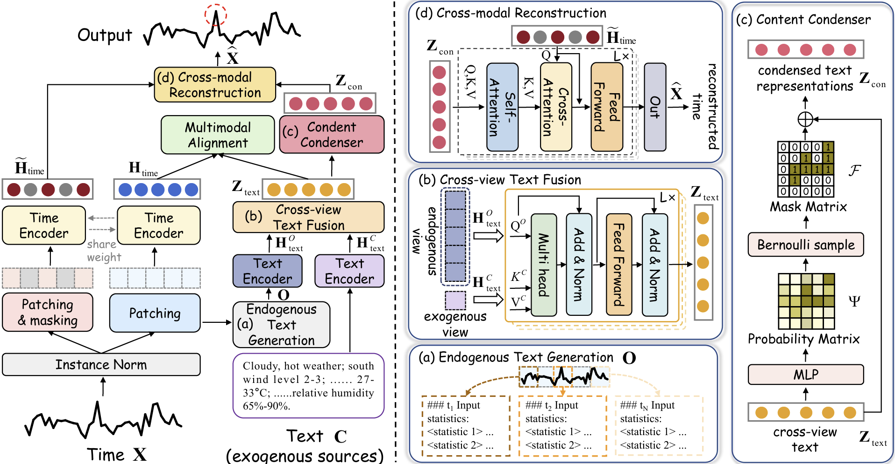
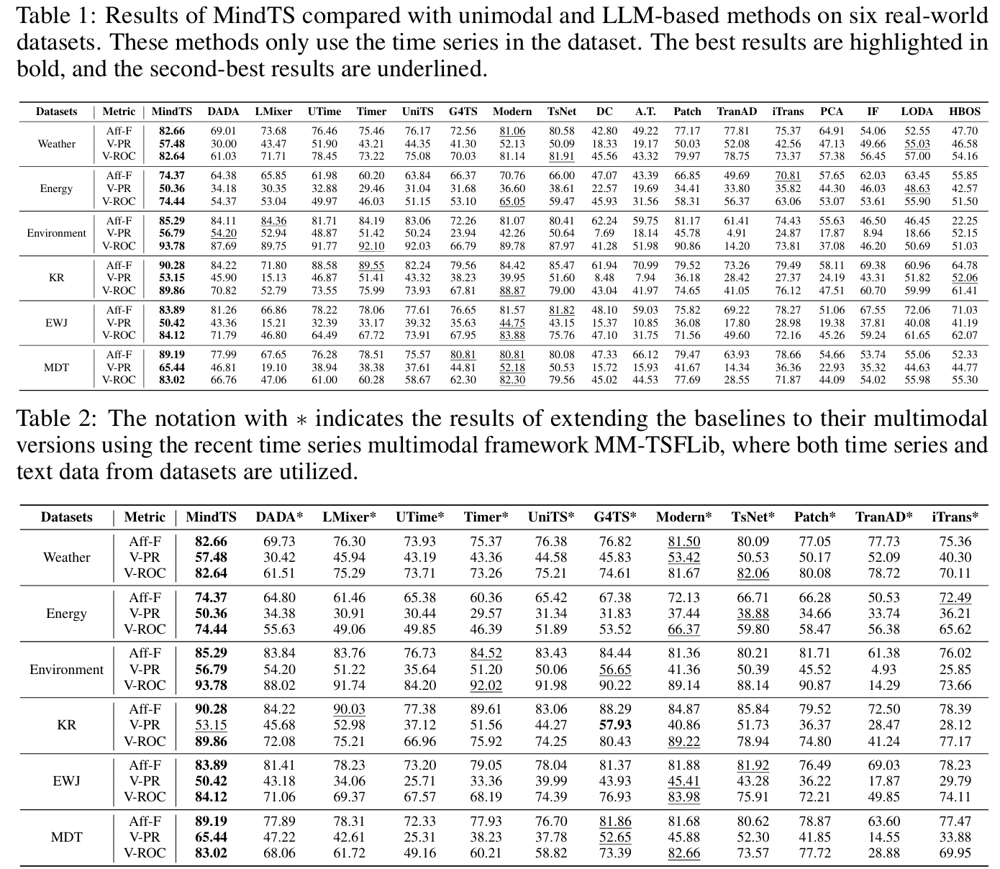

# Towards Multimodal Time Series Anomaly Detection with Semantic Alignment and Condensed Interaction
**This code is the official PyTorch implementation of our ICLR'26 paper [MindTS](https://arxiv.org/abs/2603.21612): Towards Multimodal Time Series Anomaly Detection with Semantic Alignment and Condensed Interaction.**

If you find this project helpful, please don't forget to give it a ⭐ Star to show your support. Thank you!


## Introduction
**MindTS**, a method based on time-text multimodal, achieves remarkable anomaly detection performance by performing fine-grained semantic alignment across modalities and reconstructing time series via cross-modal interactions. Specifically, we propose a fine-grained time-text semantic alignment module that divides the text into two complementary views: exogenous text and endogenous text. The exogenous text contains background information from external sources, making it suitable for sharing across different time steps. In contrast, the endogenous text is derived directly from the time series, exhibiting time-specific characteristics correlated with temporal patterns. To achieve semantic consistency alignment between time-text pairs, we apply cross-view fusion to integrate the complementary strengths of the two text views. The resulting fused text is further aligned with the time series. Furthermore, we propose a content condenser reconstruction mechanism to filter redundant text information and enhance the effectiveness of cross-modal interaction. Specifically, based on the aligned text representations as input, the content condenser filters out redundant information from the text by minimizing mutual information, resulting in condensed text representations. The condensed text representations are then directly used to reconstruct the complete time series, resulting in more reliable and efficient cross-modal interaction.

<div style="text-align: center;">
    
</div>

## Quickstart

### Installation
Given a python environment (**note**: this project is fully tested under python 3.8), install the dependencies with the following command:

   ```bash
   pip install -r requirements.txt
   ```


## Data preparation
Prepare Data. You can obtain the pre-processed datasets from the ./dataset folder. If you need to add new datasets, you can also place them in this folder.

## Train and evaluate model
- To see the model structure of MindTS, [click here](./ts_benchmark/baselines/MindTS/MindTS.py).

- For example you can reproduce a experiment result as the following:

```bash
sh ./scripts/univariate_detection/detect_label/MDT_script/MindTS.sh

sh ./scripts/multivariate_detection/detect_label/Weather_script/MindTS.sh
```

## Results
Extensive experiments on 6 real-world datasets demonstrate that MindTS achieves state-of-the-art performance:

<div style="text-align: center;">
    
</div>

## Citation
If you find this repo useful, please cite our paper.

```bash
@inproceedings{hu2026mindts,
  title={Towards Multimodal Time Series Anomaly Detection with Semantic Alignment and Condensed Interaction},
  author={Hu, Shiyan and Jin, Jianxin and Shu, Yang and Chen, Peng and Yang, Bin and Guo, Chenjuan},
  journal={ICLR},
  year={2026}
}
```

## Contact
If you have any questions or suggestions, feel free to contact:
- Shiyan Hu (syhu@stu.ecnu.edu.cn)
